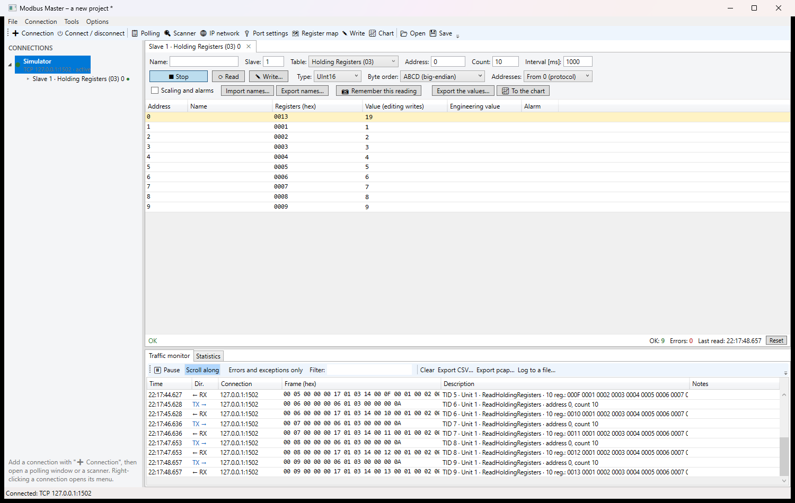

# Modbus Master

A Modbus master for Windows: poll registers, find devices whose settings nobody wrote down, map out an
undocumented address space, listen to an RS-485 line, simulate a slave — and do all of it from a command line
as well.

Speaks **RTU**, **ASCII**, **TCP**, **UDP**, **RTU over TCP** and **Modbus/TCP Security (TLS)**.

A native Windows program (.NET 8). Nothing to install besides the program itself: the runtime is included.

> **This is a beta.** It is complete enough to use on real equipment, but it has not been through a season of
> daily work. Expect bugs, and **please report them** — see [Reporting a problem](#reporting-a-problem).



*A polling window reading ten holding registers from the built-in simulator, with every request and answer
decoded underneath - which is usually what settles an argument about a device.*

## Download

The latest [release](../../releases) has, for Windows x64:

| File | For |
|---|---|
| `ModbusMaster-<version>-x64.msi` | install for all users: Start menu shortcut, firewall rule for TCP 502, `mmcli` on `PATH` |
| `ModbusMaster-<version>-x64-portable.zip` | unpack and run; all data stays in a `Data` folder beside the program |

The portable build writes nothing to the user profile as long as `portable.txt` sits next to the executable,
so it runs from a memory stick. The packages are not digitally signed, so SmartScreen warns about an unknown
publisher.

Silent install: `msiexec /i ModbusMaster-<version>-x64.msi /qn`.

## What it does

**Polling windows** — a table of registers or bits, cyclic or on demand. Per address: a name, scale, offset,
unit and alarm limits. A remembered reading to compare the current one against, CSV export, and names that
import and export as CSV so a register list can come from a spreadsheet.

**Writing** — from a polling row or from the write dialog. The confirmation names the address and the value
and shows the register words in hex before they are sent; FC15/FC16 can be forced; every write goes to
`audit.log`.

**Finding devices**
- **Slave address scanner** — 0..255, including the addresses that answer with an exception, which is still an
  answer.
- **IP network scanner** — a CIDR range or a from–to range, with optional device identification.
- **Serial parameter detection** — baud rate and character format tried in the order of how common they are.
  Corrupt answers are reported as near misses, because they usually mean the parity is wrong rather than the
  address.

**Register map** — reads large blocks and halves the ones refused with exception 02 until it knows which
ranges actually exist. The fastest way into a device whose documentation is missing.

**Sniffer** — listens to an RS-485 line and sends nothing at all, pairing requests with answers and decoding
both. Traffic exports as **pcap** for Wireshark.

**Slave simulator** — TCP, UDP or serial, several unit ids at once, for testing without hardware.

**Device templates** — a saved set of polling windows with their names, applied to a connection in one step.

**Trends and charts**, and publishing the polled values to **MQTT** or **InfluxDB**.

### Point addresses

`<table>:<address>[:<type>][/<order>][*<scale>][@<slave>]`

| Example | Meaning |
|---|---|
| `hr:100:F32` | holding register 100, 32-bit float |
| `hr:40:I16*0.1` | holding register 40 as an integer scaled by 0.1 — the usual way a temperature arrives |
| `ir:7:U32/CDAB` | input register 7, 32-bit unsigned, words swapped |
| `co:12` | coil 12 |
| `hr:7:F32@3` | as above but on slave 3 instead of the connection's default — what a gateway needs |

Tables: `hr` holding, `ir` input, `co` coil, `di` discrete input. Input registers and discrete inputs are
read-only, and a write to one is refused with a reason before a frame is sent.

## mmcli — the same engine on the command line

```
mmcli read tcp:10.0.0.5 -u 3 -t hr -a 100 -n 10 --type Float32
mmcli write rtu:COM3:19200:8E1 -u 7 -a 40 -v 21.5 --type Float32
mmcli scan  rtu:COM3:9600:8N1 --from 1 --to 247
mmcli map   tcp:10.0.0.5 -t hr -n 2000
mmcli detect COM3 --units 1,2,3
mmcli run   commissioning.mms --log run.txt
```

`run` executes a script of commands with `expect` checks, which is what commissioning wants: the exit code
distinguishes a usage error, a communication error, a device exception and a failed check, so it slots into a
build or a test run. `mmcli help` lists everything.

## Writing to a device

These properties hold everywhere in the program and cannot be switched off:

- every write is confirmed first, naming the address and the value;
- every write is recorded in `audit.log` with time, user, target, address and value;
- **read-only mode** refuses every write at the transport, so nothing can leave the program by any route —
  turn it on before connecting to an installation you are only allowed to look at;
- input registers and discrete inputs are read-only.

## Using it

The interface is **Polish, English or German**, switched in the title bar and applied at once — and so is
`mmcli`, including its `--help`.

## Known limits

- The sniffer needs a port that can hear the line: an RS-485 adapter in listen-only mode, or a tap.
- Modbus has no discovery, so finding devices means asking one address after another. A range is capped so a
  typo cannot sweep a whole network.

## Reporting a problem

Send what you did, what happened, what you expected, and the traffic if you have it — the traffic list exports
as CSV or pcap, and it usually settles the question on its own.

[Open an issue](../../issues) or write to **kontakt@ihvac.pl**.

## Licence

MIT. The source lives in a private repository; the released programs bundle only MIT-licensed libraries.

There is no warranty of any kind. The software writes to industrial devices; the installation you connect it
to stays your responsibility.
